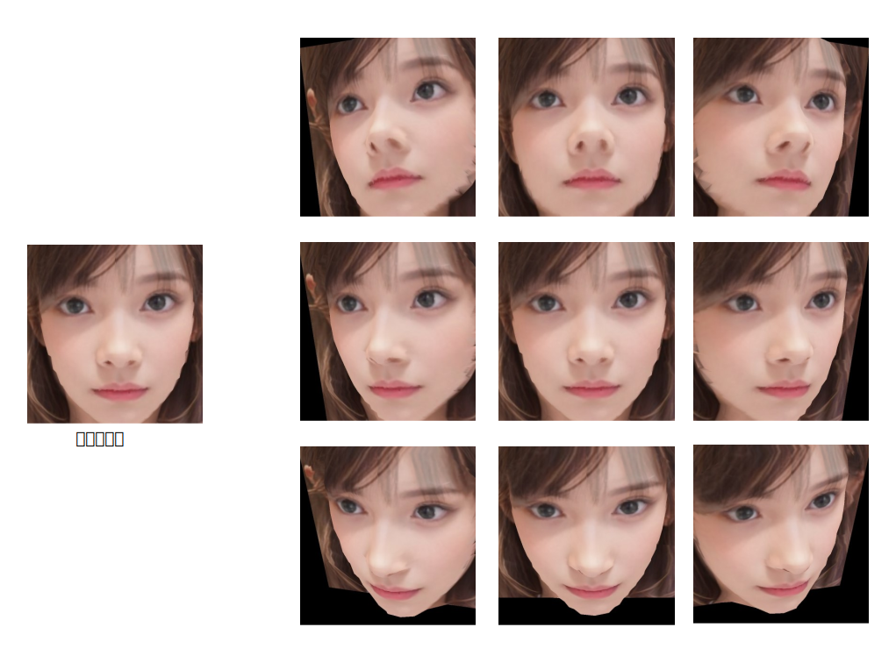

<html lang="ja">
    <head>
        <meta charset="utf-8" />
    </head>
    <body>
        <h1>
Face3D
</h1>
        <h2>なにものか？</h2>
        

            Mediapipeを使って取得したFacemeshをOpenGLで3D表示します。 
             
            ※顔以外(首、髪の毛、背景など)は3D推定されていないので不自然に3D変形してしまいます。 
            "_(画像ファイル名).ply"に3Dメッシュを出力するので、必要に応じてBlenderなどで修正してください。 
            
        

        <h2>環境構築方法</h2>
        

            pip install mediapipe PyOpenGL glfw
        

        <h2>使い方</h2>
        

            python Face3d.py (顔画像ファイル名) 
             
            <table border="1">
                <tr><th>操作</th><th>機能</th></tr>
                <tr><td>左ボタン押下＋ドラッグ</td><td>3Dモデルの回転</td></tr>
                <tr><td>右ボタン押下＋ドラッグ</td><td>3Dモデルの移動</td></tr>
                <tr><td>ホイール回転</td><td>3Dモデルの拡大・縮小</td></tr>
                <tr><td>ホイールボタン押下</td><td>慣性モードのトグル(on⇔off)</td></tr>
                <tr><td>iキー押下</td><td>慣性モードのトグル(on⇔off)</td></tr>
                <tr><td>sキー押下</td><td>スクリーンショット保存</td></tr>
                <tr><td>ウィンドウ閉じるボタン押下　</td><td>プログラム終了</td></tr>
            </table>
        

    </body>
</html>
